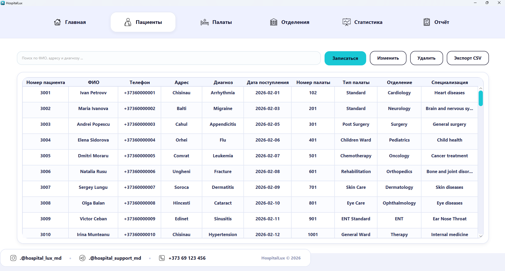
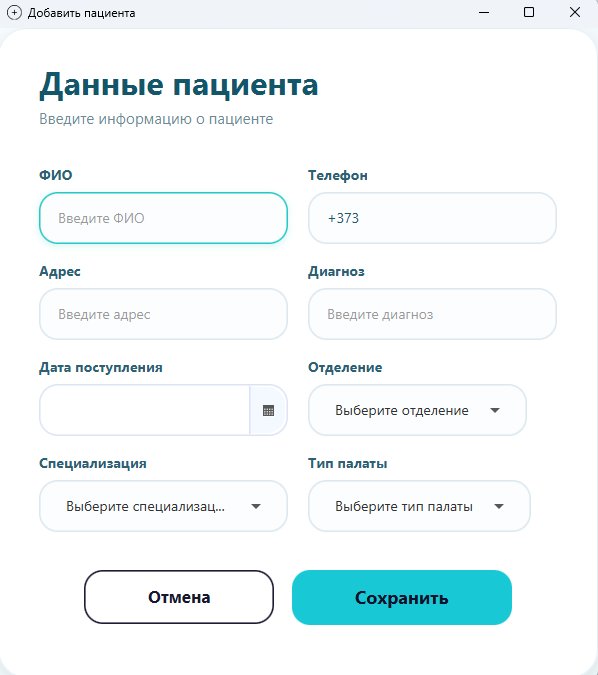
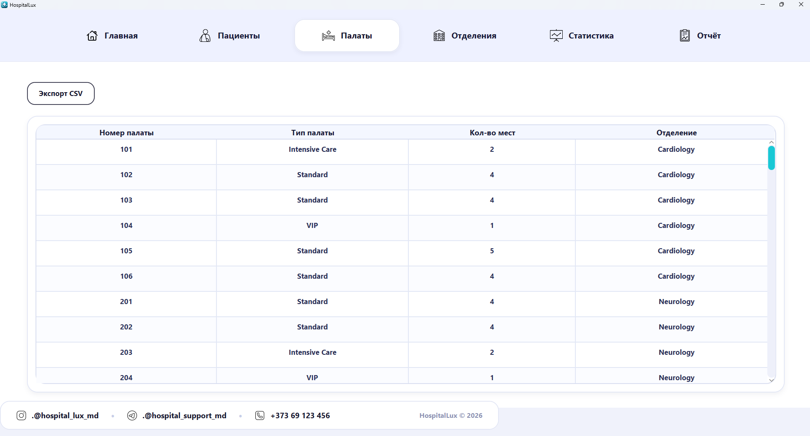
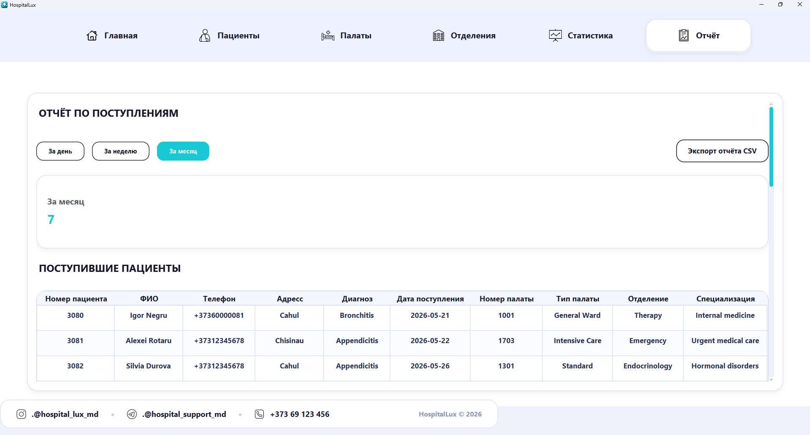
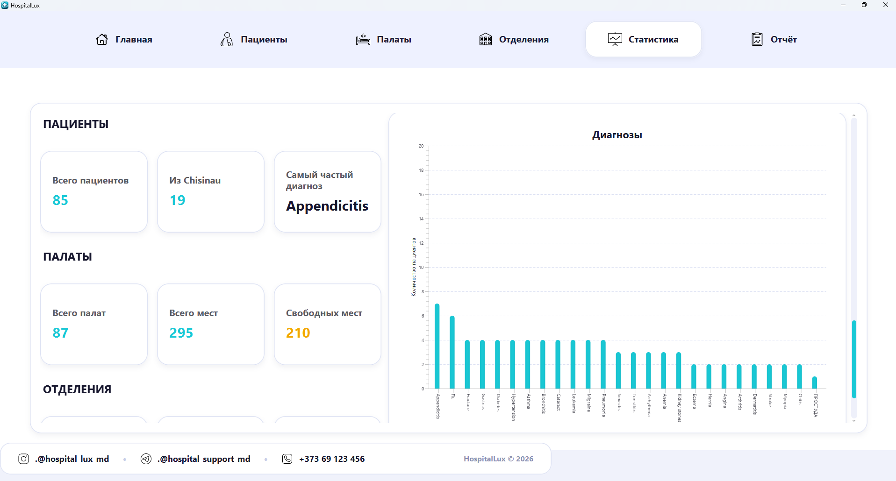

# HospitalLux

**HospitalLux** — это desktop-приложение для учета пациентов, палат и отделений больницы.  
Проект разработан на JavaFX с подключением к базе данных SQL Server.

## Описание проекта

Приложение позволяет сотруднику медицинского учреждения удобно работать с данными пациентов, просматривать информацию о палатах и отделениях, формировать отчеты и экспортировать данные в CSV-файл.

## Возможности

- добавление пациентов;
- редактирование данных пациентов;
- удаление пациентов;
- просмотр списка пациентов;
- просмотр палат и отделений;
- поиск и фильтрация данных;
- проверка свободных мест в палатах;
- формирование отчетов;
- экспорт данных в CSV;
- валидация введённых данных.

## Технологии

- Java
- JavaFX
- FXML
- CSS
- JDBC
- SQL Server
- Maven

## Screenshots

Screenshots of the application are stored in the `screenshots` folder of this repository.

### Main Window


### Patients



### Add / Edit Patient Form



### Wards



### Reports



### Statistics


## Структура проекта

```text
HospitalLux
├── src
│   └── main
│       ├── java
│       │   └── com.example.practica
│       │       ├── controller
│       │       ├── db
│       │       ├── model
│       │       ├── repository
│       │       └── service
│       └── resources
├── database
│   └── hospitallux.sql
├── pom.xml
